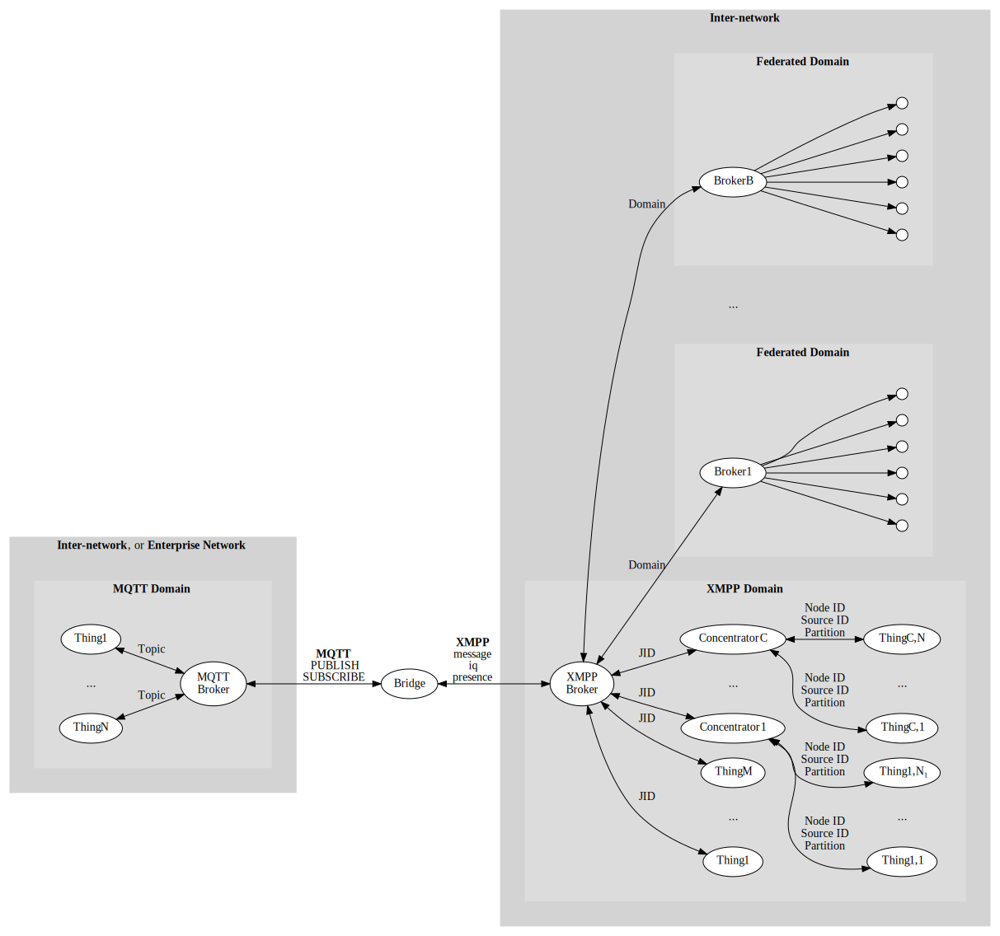

IoTBridgeMqtt
================

Provides an IoT bridge between devices connected to [MQTT](https://mqtt.org/), for use in
closed intra-networks or enterprise networks, and the harmonized XMPP-based 
[Neuro-Foundation](https://neuro-foundation.io/) network, for open and secure cross-domain
interoperation on the Internet.

To run the bridge, you need access to both an MQTT broker, and an XMPP broker, that supports
the Neuro-Foundation extensions. You can use the [Mosquitto broker](https://mosquitto.org/)
for MQTT, and the [TAG Neuron](https://lab.tagroot.io/Documentation/Neuron/InstallBroker.md)
for XMPP.

Running and configuring the bridge
-------------------------------------

The code is written using .NET Standard, and compiled to a .NET Core console application
that can be run on most operating systems. Basic configuration is performed using the
console interface during the first execution, and persisted. You can also provide the
corresponding configuration using environment variables, making it possible to run the
bridge as a container. If an environmental variable is missing, the user will be prompted
to input the value on the console.

| Environmental Variable    | Type    | Description                                                                                                           |
|:--------------------------|:--------|:----------------------------------------------------------------------------------------------------------------------|
| `XMPP_HOST`               | String  | XMPP Host name                                                                                                        |
| `XMPP_PORT`				| Integer | Port number to use when connecting to XMPP (default is `5222`)                                                        |
| `XMPP_USERNAME`			| String  | User name to use when connecting to XMPP.                                                                             |
| `XMPP_PASSWORD`			| String  | Password (or hashed password) to use when connecting to XMPP. Empty string means a random password will be generated. |
| `XMPP_PASSWORDHASHMETHOD`	| String  | Algorithm or method used for password. Empty string means the password is provided in the clear.                      |
| `XMPP_APIKEY`				| String  | API Key. If provided together with secret, allows the application to create a new account.                            |
| `XMPP_APISECRET`			| String  | API Secret. If provided together with key, allows the application to create a new account.                            |
| `REGISTRY_COUNTRY`		| String  | Country where the bridge is installed.                                                                                |
| `REGISTRY_REGION`			| String  | Region where the bridge is installed.                                                                                 |
| `REGISTRY_CITY`			| String  | City where the bridge is installed.                                                                                   |
| `REGISTRY_AREA`			| String  | Area where the bridge is installed.                                                                                   |
| `REGISTRY_SRTEET`			| String  | Street where the bridge is installed.                                                                                 |
| `REGISTRY_STREETNR`		| String  | Street number where the bridge is installed.                                                                          |
| `REGISTRY_BUILDING`		| String  | Building where the bridge is installed.                                                                               |
| `REGISTRY_APARTMENT`		| String  | Apartment where the bridge is installed.                                                                              |
| `REGISTRY_ROOM`			| String  | Room where the bridge is installed.                                                                                   |
| `REGISTRY_NAME`			| String  | Name associated with bridge.                                                                                          |
| `REGISTRY_LOCATION`		| Boolean | If location has been completed. (This means, any location-specific environment variables not provided, will be interpreted as intensionally left blank, and user will not be prompted to input values for them. |
